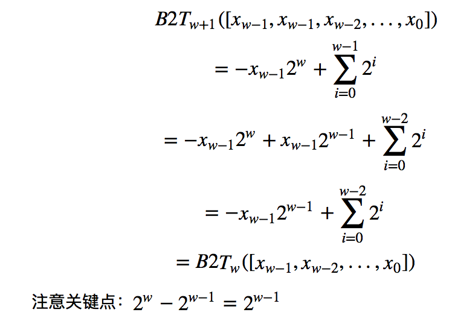
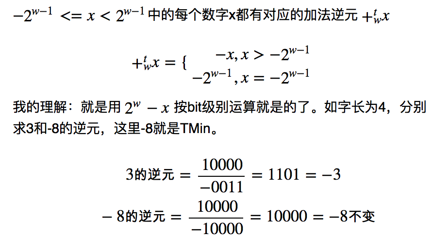

# 2 信息的表示和处理


### 整数运算和浮点运算会有不同的数学属性，因为他们处理数字表示有限性的方式不同-精确vs近似

### 十进制和十六进制直接的转换（Python）

[d2h.py](d2h.py), [h2d.py](h2d.py)

### C语言中char 1B,short 2B, int 4B, 长整数和指针长度等于机器的字长（这里8）,float=4B, double=8B
[type_len.c](type_len.c)

### 我们要让程序对不同数据类型的确切大小不敏感，这样有更好的移植性，比如32位系统把指针赋给int是OK的但是到了64位系统中会导致问题

### 使用强制类型转发来访问不同程序对象的字节表示,
[show-bytes.c](show-bytes.c)

```shell
✗ ./show-bytes  1234
 39 30 00 00
 00 e4 40 46
 2c 5b c9 5b ff 7f 00 00
````

### 文本数据比而进程具有更强的平台独立性，因为字符串的表示本身做了抽象，字符串总是从地址开始遇到0x00结束，与字节顺序和字大小规则无关

如，show_bytes("12345", 6) 得到结果31 32 33 34 35 00

### 练习题2.7 下面的输出结果是0x61-0x66, 没用00，因为strlen不计最后的null
```c
const char *s = "abcdef";
show_bytes((byte_pointer)s, strlen(s));
```

### 查看机器代码，二进制代码是不兼容的（hexdump sum.o）
[sum.c](sum.c)

在我的mac 64是：00001d0 55 48 89 e5 89 7d fc 89 75 f8 8b 75 fc 03 75 f8

### 位向量一个很有用的应用是用来表示有限集合，对应的那个bit=1表示对应的元素存在，有点Bloom filter的味道

### 习题2.10 对任何一个向量a, a^a = 0， 应用这一属性，有下面的swap程序。
[inplace_swap.c](inplace_swap.c) 没用使用中间变量，这种交换方式不会有性能上的优势，仅仅是智力游戏

```c
*y = *x ^ *y;
*x = *x ^ *y;
*y = *x ^ *y;
```

很容易理解：执行第2行的时候，*x = *x ^ *y = *x ^ (*x ^ *y) = *y; 异或满足交换律，此时x地址里面存储的是y里面的值，然后第3行：*y = *x ^ *y = *y ^ (*x ^ *y) = *x  如此而已

### 习题2.11 承上题，利用上面的swap函数实现对调一个数组的元素，源程序的问题是对中间元素自身异或自身得到0
[reverse_array.c](reverse_array.c)

### 位级运算的一个常见应用是实现掩码运算，掩码是一个位模式。使用类似~0得到全1的掩码，而非使用0XFFF-F, 考虑移植性

### 习题2.13 只有bis和bic实现位设置和清除，而不使用其他C语言运算，实现位级|和^运算

理清题意：bis(x,m)对m的为1的bit对x置1，对应地，bic对应的bit清0， 而不是操作第mbit

异或的性质：x ^ y = (x & ~y) | (y & ~x) , x中的bits不被y包含的（x & ~y）加上y中的bits不被x包含的。

[bis_bic.c](bis_bic.c)

### 几乎所有的编译器/机器都会对有符号书使用算术右移，Java中可以明确指定

[Shift.java](Shift.java)

### 注意在C中，加法比移位运算优先级高，所以要写成 (1 << 2) + 3, 所以不确定就加括号吧，少年

### B2Uw函数(Binary to Unsinged)，B2Tw(Binary to Two's-complement)都是双射函数，相应的数和二进制向量唯一映射

### C语言标准没有要求用补码表示有符号整数，但是几乎所有的机器都是这么做的。但是保证最大移植性的做法是利用 limits.h中的典型取值范围，而不要自我假设

### 有符号数和无符号数强制类型转化结果位保持不变，只是改变了解释这些位的方式：数值可能会改变，但是位模式不变
[unsigned_cast.c](unsigned_cast.c)

### 理解有符号数和无符号数强制类型转化之间的数学关系


### printf没用任何类型信息，可以用%d输出unsigned类型，也可以用%u输出int类型
[printf_no_type.c](printf_no_type.c)

### C语言运算表达式中如果一个是有符号数一个是无符号数，则会隐式的将有符号转换为无符号，来执行运算, 对标准算术运算可能差异不大，但是对于关系运算就要注意了
[type_cast_op.c](type_cast_op.c)

### 对于提升数据类型（位扩展），无符号数总是零扩展，有符号数是符号扩展
[zero_sign_extension.c](zero_sign_extension.c),  OSX是小端，所以输出 c7 cf ff ff

### 证明符号扩展的正确性, 利用数学归纳法，证明一位扩展正确即可


### C语言标准：把short转换成unsigned时，先改变大小再完成从有符号到无符号的转换。 short -> int -> unsigned
[type_cast_mystery.c](type_cast_mystery.c)

### 习题2.25 问题在于无符号运算, 0U - 1 = UMax, 然后访问非法地址，coredump
[sum_elements.c](sum_elements.c)

### 习题2.26 问题仍然是无符号运算的微妙，size_t定义为unsigned int. 在做差和比较时会采用无符号运算，如果a<b, a-b是负数，会成为一个很大的无符号数，所以结果不正确
[stronger.c](stronger.c)

### 无符号加法可以视为模数运算，溢出的最高一位丢弃。判断是否无符号相加是否发生了overflow，就看是否结果反而结果变小了
[uadd_ok.c](uadd_ok.c)

### 阿贝尔群（Abelian group）的概念，无符号数的加法逆元  P56

看到这里我滋生了对**无符号数减法**的一点认识，比如0U-1U = UMax 怎么理解呢？拿具体的无符号3-4，假设字长为4bit，一方面我们可以从比特级别来解释所有，
-4就是补码形式1100, 只不过现在我们把他看成无符号数，那么 1100 + 0011 = 1111 = 15； 另一方面既然是无符号数相加，那么加上 2 ^ w 自然不会有副作用吧，
所以我们加上一个元 3-4 + 2^4 = 3+16-4=15, 殊途同归，似乎有那么点意思。

### 判断补码加法的溢出
[tadd_ok.c](tadd_ok.c), 无论是否溢出 x + y - x == y

### 在任何时候都要考虑 Max， Min这些临界情况，比如 INT_MIN的逆元就是其自身

习题 2.32 [tsub_ok.c](tsub_ok.c) , 问题在于 当y=INT_MIN， -y=INT_MIN， x>0, 使用tadd_ok自然发现俩异号，不会溢出，但是 x - y就会发生溢出（上溢）

其实不要把逆元现象的太复杂，其实就是用那个模值-元素，比如假设字长4bit，求TMin得逆元，从bit级别上很容易理解  10000 - 1000 = 1000 ，所以TMin保持不变

### 理解加法逆元的哲学，对补码的逆就是补码的非negation


### 乘法运算的位级表示都是一样的，相乘，然后只截断为w，进而解释为无符号或补码形式，这样机器级的指令只需要一种，同构

### 习题2.35 判断乘法是否溢出
[tmult_ok.c](tmult_ok.c)

### C编译器使用以移位 加法 减法来消除很多乘以常数的情况来减小计算代价

### IEEE754

vonzhou 2016.3.5下午 HUST图书馆