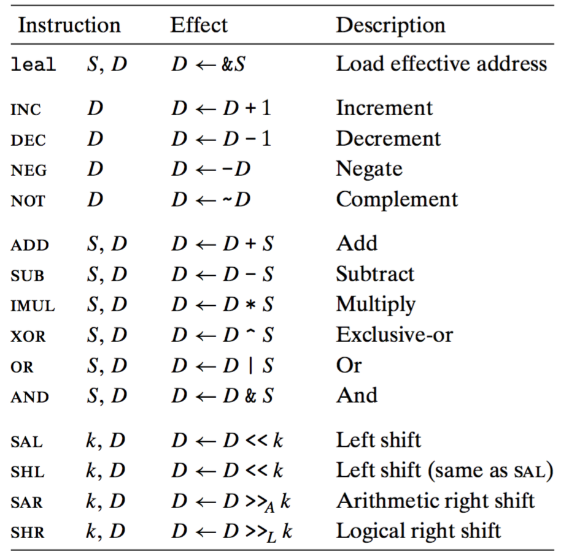
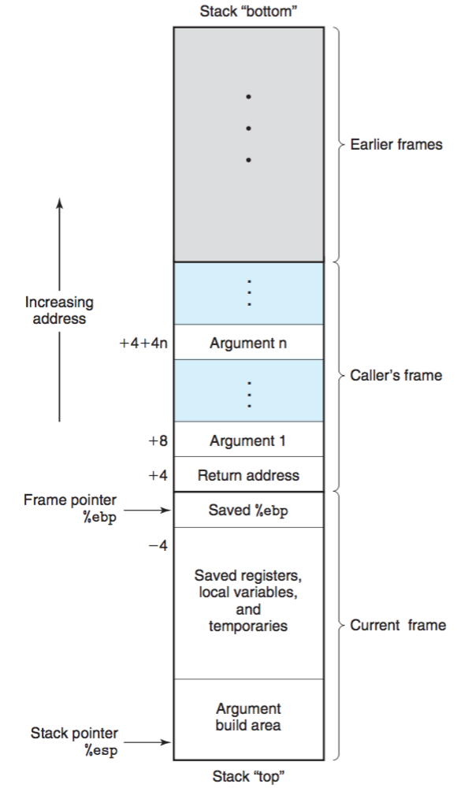

# 程序的机器级表示
---


> ## 精通细节是理解更深和更基本概念的先决条件 "This is a subject where mastering the details is a prerequisite to understanding the deeper and more fundamental concepts"

### 机器级编程的2种抽象：指令集结构，虚拟地址

### 使用反汇编器，64位系统下指定-m32生成32位的，和书中给出的代码不一样，所以阅读本章的目的是读懂汇编代码

```
Disassembly of section .text:

0000000000000000 <sum>:
   0:	8d 04 37             	lea    (%rdi,%rsi,1),%eax
   3:	01 05 00 00 00 00    	add    %eax,0x0(%rip)        # 9 <sum+0x9>
   9:	c3                   	retq   
```
指定-m32：

```
00000000 <sum>:
   0:	8b 44 24 08          	mov    0x8(%esp),%eax
   4:	03 44 24 04          	add    0x4(%esp),%eax
   8:	01 05 00 00 00 00    	add    %eax,0x0
   e:	c3                   	ret    

```

### IA32整数寄存器


### 数据传送示例-P116
[exchange.c](exchange.c)

```
vonzhou@ubuntu:~/Github/CSAPP/chapter03$ gcc -m32 -O1 -c exchange.c 
vonzhou@ubuntu:~/Github/CSAPP/chapter03$ objdump -d exchange.o 

exchange.o:     file format elf32-i386


Disassembly of section .text:

00000000 <exchange>:
   0:	8b 54 24 04          	mov    0x4(%esp),%edx
   4:	8b 02                	mov    (%edx),%eax
   6:	8b 4c 24 08          	mov    0x8(%esp),%ecx
   a:	89 0a                	mov    %ecx,(%edx)
   c:	c3                   	ret    
```

理解：过程加载后，xp和y分别存储在相对于寄存器esp偏移4，8的地方，这里是esp（**和书中不同**），说明了两个参数是存储在栈中，栈也是存储的一部分，只不过通过esp来控制访问的。mov    0x4(%esp),%edx 将xp的值加载到edx中，mov    (%edx),%eax 将xp对应的地址处的值加载到eax中，mov    0x8(%esp),%ecx将y的值加载到ecx中，mov    %ecx,(%edx)将y的值存储到xp对应的存储地址处，ret返回，返回值在eax中，正是*xp之前的值;

1. C语言中的指针其实就是地址，引用指针就是将指针取到寄存器中，然后在存储器访问中使用这个寄存器
2. 函数体中的局部变量x存在寄存器，而非存储器中


### 整数算术操作指令


LEA没用引用存储器，只是进行地址计算，而MOV是加载那个地址处的值到寄存器中。具体形式为 LEA Imm(ra,rb,n) D ：表示 n * rb + ra 的值写入寄存器D

### 移位指令中，移位量是单字节编码，移位量是立即数或者放在单字节寄存器%cl中，注意只能是这个寄存器

### 一个算术操作函数产生的汇编代码分析
[arith.c](arith.c)

```c
int arith(int x, int y, int z){
	int t1 = x + y;
	int t2 = z * 48;
	int t3 = t1 & 0xFFFF;
	int t4 = t2 * t3;
	return t4;
}
```


```bash
vonzhou@ubuntu:~/Github/CSAPP/chapter03$ objdump -d arith.o 

arith.o:     file format elf32-i386


Disassembly of section .text:

00000000 <arith>:
   0:	8b 44 24 0c          	mov    0xc(%esp),%eax
   4:	8d 04 40             	lea    (%eax,%eax,2),%eax
   7:	c1 e0 04             	shl    $0x4,%eax
   a:	8b 54 24 08          	mov    0x8(%esp),%edx
   e:	03 54 24 04          	add    0x4(%esp),%edx
  12:	0f b7 d2             	movzwl %dx,%edx
  15:	0f af c2             	imul   %edx,%eax
  18:	c3                   	ret  
```

分析：可以看到参数 x,y,z 分别放在栈的临近位置，先计算的是z * 48 而不是按函数中给出的顺序，前3条指令意思是 z -> eax -> 2 * z + z = 3z -> 3z << 4 -> 3z * 16 = 48z; 接下来的2条计算x+y；然后利用MOVZ只保留低2B；最后相乘，并且结果保存在EAX中，返回

### 机器代码提供两种低级机制来实现有条件的行为：测试数据值，然后根据测试的结果改变控制流或数据流

### 常用的条件码


### 对于不同的操作会设置/检查不同的条件码组合，下面是a，b是否相等的决策过程

SET指令的通用规则是：执行cmp指令，根据计算t=a-b设置条件码

1. 如果是补码表示形式。零标志决定了是否相等，如果不等，看OF是否发生了溢出，如果没发生溢出的话，看符号位是正（a>b）是负(a<b); 如果发生溢出，则规则对应地
2. 如果是无符号表示。看零标志和进位标志

### 在汇编代码中跳转目标用符号标号书写，汇编器及后面的链接器，会产生跳转目标的适当编码：相对（PC-relative）或绝对地址。

### 当执行PC-relative寻址时，程序计数器的值是跳转指令后面那条指令的地址，而不是跳转指令本身的地址，因为处理器将更新PC作为执行一条指令的first step

### 条件语句的编译
[absdiff.c](absdiff.c),   [gotodiff.c](gotodiff.c)

```bash
absdiff.o:     file format elf32-i386


Disassembly of section .text:

00000000 <absdiff>:
   0:	53                   	push   %ebx
   1:	8b 4c 24 08          	mov    0x8(%esp),%ecx
   5:	8b 54 24 0c          	mov    0xc(%esp),%edx
   9:	89 d3                	mov    %edx,%ebx
   b:	29 cb                	sub    %ecx,%ebx
   d:	89 c8                	mov    %ecx,%eax
   f:	29 d0                	sub    %edx,%eax
  11:	39 d1                	cmp    %edx,%ecx
  13:	0f 4c c3             	cmovl  %ebx,%eax
  16:	5b                   	pop    %ebx
  17:	c3                   	ret    
```

**cmovl**：利用前面比较得到的条件码，进行有条件的mov，这里的条件是”less than“，后面有详述

### 初探do-while的汇编代码
[fact_do.c](fact_do.c)

```bash
00000000 <fact_do>:
   0:	8b 54 24 04          	mov    0x4(%esp),%edx
   4:	b8 01 00 00 00       	mov    $0x1,%eax
   9:	0f af c2             	imul   %edx,%eax
   c:	83 ea 01             	sub    $0x1,%edx
   f:	83 fa 01             	cmp    $0x1,%edx
  12:	7f f5                	jg     9 <fact_do+0x9>
  14:	f3 c3                	repz ret 
```

**可以看到：**循环控制变量n在edx中，result在eax中，跳转使用的相对地址，至于repz ret的含义不太理解，说AMD的分支预测有问题如果只用一个ret

### 初探while的汇编代码
[fact_while.c](fact_while.c)

```
00000000 <fact_while>:
   0:	8b 54 24 04          	mov    0x4(%esp),%edx
   4:	83 fa 01             	cmp    $0x1,%edx
   7:	7e 12                	jle    1b <fact_while+0x1b>
   9:	b8 01 00 00 00       	mov    $0x1,%eax
   e:	0f af c2             	imul   %edx,%eax
  11:	83 ea 01             	sub    $0x1,%edx
  14:	83 fa 01             	cmp    $0x1,%edx
  17:	75 f5                	jne    e <fact_while+0xe>
  19:	f3 c3                	repz ret 
  1b:	b8 01 00 00 00       	mov    $0x1,%eax
  20:	c3                   	ret
```

**可以看到：**先判断条件，然后和do-while一样，在每个条件跳转指令之后都加上了repz ret 

### 初探for-loop的汇编代码
[fact_for.c](fact_for.c)

```
00000000 <fact_for>:
   0:	8b 4c 24 04          	mov    0x4(%esp),%ecx
   4:	83 f9 01             	cmp    $0x1,%ecx
   7:	7e 16                	jle    1f <fact_for+0x1f>
   9:	b8 01 00 00 00       	mov    $0x1,%eax
   e:	ba 02 00 00 00       	mov    $0x2,%edx
  13:	0f af c2             	imul   %edx,%eax
  16:	83 c2 01             	add    $0x1,%edx
  19:	39 d1                	cmp    %edx,%ecx
  1b:	7d f6                	jge    13 <fact_for+0x13>
  1d:	f3 c3                	repz ret 
  1f:	b8 01 00 00 00       	mov    $0x1,%eax
  24:	c3                   	ret  
```

可以看到没啥区别，除了控制变量递增，上述三种循环控制效率是一样的

### 基于条件传送指令的代码比基于条件控制转移的代码性能好，控制流不依赖于数据，使得处理器更容易保持流水线是满的
[absdiff_condition.c](absdiff_condition.c), [cmovdiff.c](cmovdiff.c)

```
00000000 <absdiff>:
   0:	53                   	push   %ebx
   1:	8b 4c 24 08          	mov    0x8(%esp),%ecx
   5:	8b 54 24 0c          	mov    0xc(%esp),%edx
   9:	89 cb                	mov    %ecx,%ebx
   b:	29 d3                	sub    %edx,%ebx
   d:	89 d0                	mov    %edx,%eax
   f:	29 c8                	sub    %ecx,%eax
  11:	39 d1                	cmp    %edx,%ecx
  13:	0f 4f c3             	cmovg  %ebx,%eax
  16:	5b                   	pop    %ebx
  17:	c3                   	ret  
```

### 和条件跳转不同，处理器执行条件传送无需预测测试的结果，处理器只是从source中读值，检查条件码，然后要么更新目的寄存器，要么保持不变，所以就没有预测错误的惩罚

### 并非所有的条件表达式都可以用条件传送来编译。两个表达式中任何一个发生错误或副作用，都会导致非法行为

### 编译器必须权衡计算开销和由于分支预测错误导致的性能处罚之间的相对性能

### 和使用一组很长的if-else相比，使用跳转表的优点是执行switch语句的时间与case的数量无关。当case数据量比较多，并且值得取值范围较小时就会使用jump table

[switch_eg.c](switch_eg.c)

```
vonzhou@ubuntu:~/Github/CSAPP/chapter03$ objdump -D -j .rodata  switch_eg.o

switch_eg.o:     file format elf32-i386


Disassembly of section .rodata:

00000000 <.rodata>:
   0:	17                   	pop    %ss
   1:	00 00                	add    %al,(%eax)
   3:	00 26                	add    %ah,(%esi)
   5:	00 00                	add    %al,(%eax)
   7:	00 1b                	add    %bl,(%ebx)
   9:	00 00                	add    %al,(%eax)
   b:	00 1e                	add    %bl,(%esi)
   d:	00 00                	add    %al,(%eax)
   f:	00 22                	add    %ah,(%edx)
  11:	00 00                	add    %al,(%eax)
  13:	00 26                	add    %ah,(%esi)
  15:	00 00                	add    %al,(%eax)
  17:	00 22                	add    %ah,(%edx)
  19:	00 00                	add    %al,(%eax)
	...
vonzhou@ubuntu:~/Github/CSAPP/chapter03$ objdump -d switch_eg.o

switch_eg.o:     file format elf32-i386


Disassembly of section .text:

00000000 <switch_eg>:
   0:	8b 44 24 04          	mov    0x4(%esp),%eax
   4:	8b 4c 24 08          	mov    0x8(%esp),%ecx
   8:	8d 51 9c             	lea    -0x64(%ecx),%edx
   b:	83 fa 06             	cmp    $0x6,%edx
   e:	77 16                	ja     26 <switch_eg+0x26>
  10:	ff 24 95 00 00 00 00 	jmp    *0x0(,%edx,4)
  17:	83 c0 0d             	add    $0xd,%eax
  1a:	c3                   	ret    
  1b:	83 c0 0a             	add    $0xa,%eax
  1e:	83 c0 0b             	add    $0xb,%eax
  21:	c3                   	ret    
  22:	0f af c0             	imul   %eax,%eax
  25:	c3                   	ret    
  26:	b8 00 00 00 00       	mov    $0x0,%eax
  2b:	c3                   	ret 
```

**分析**:没有生成像书中那么好看的jump table，也没有那么明显，但是的确有，主要的思想不是有个表赤裸裸的放在那里，而是快速定位要执行的指令。开始指令分析，n -> ecx , x -> eax, (n-100) -> edx , 100就是0X64， 然后比较如果edx超过6，那么就执行default（返回0），否则执行间接jump，间接地址是怎么计算的呢？4 * edx + 0， 立即数0说明跳转表就在该指令的后面，然后根据不同的情况定位到不同的指令块，比如说case 102, edx=2,就会jmp到：

```
1b:   83 c0 0a                add    $0xa,%eax
1e:   83 c0 0b                add    $0xb,%eax
21:   c3                      ret 
```


### C语言层面上的跳转表
[switch-eg-impl.c](switch_eg_impl.c)

```
00000000 <switch_eg_impl>:
   0:	8b 44 24 08          	mov    0x8(%esp),%eax
   4:	83 e8 64             	sub    $0x64,%eax
   7:	83 f8 06             	cmp    $0x6,%eax
   a:	77 07                	ja     13 <switch_eg_impl+0x13>
   c:	ff 24 85 00 00 00 00 	jmp    *0x0(,%eax,4)
  13:	f3 c3                	repz ret 
  15:	b8 00 00 00 00       	mov    $0x0,%eax
  1a:	eb 16                	jmp    32 <switch_eg_impl+0x32>
  1c:	8b 44 24 04          	mov    0x4(%esp),%eax
  20:	8d 04 40             	lea    (%eax,%eax,2),%eax
  23:	8b 54 24 04          	mov    0x4(%esp),%edx
  27:	8d 04 82             	lea    (%edx,%eax,4),%eax
  2a:	c3                   	ret    
  2b:	8b 44 24 04          	mov    0x4(%esp),%eax
  2f:	83 c0 0a             	add    $0xa,%eax
  32:	83 c0 0b             	add    $0xb,%eax
  35:	c3                   	ret    
  36:	8b 44 24 04          	mov    0x4(%esp),%eax
  3a:	0f af c0             	imul   %eax,%eax
  3d:	c3                   	ret  
```

* GCC语法，&& 创建一个指向代码位置的指针
* GCC支持 computed goto, 是对C的扩展，代码中的 go *jt[index]


### 为单个过程分配的那部分栈称为栈帧 stack frame


调用者P调用被调用者Q，Q的参数放在P的栈帧中，栈帧的最后放的是当前调用者P的返回地址，栈帧以保存EBP开始。

### call指令将返回地址（紧跟call之后那条指令的地址）入栈，并跳转到被调用过程的起始处。ret指令从栈中弹出地址，并跳转到该处

### 寄存器使用惯例
eax,edx,ecx划为调用者保存寄存器，ebx,esi,edi划分为被调用者保存寄存器。意味着如果被调用者如果要使用那些寄存器，就在使用前保存，使用完后恢复

### 过程调用示例
[caller.c](caller.c)

注意通过链接后才看到caller的汇编代码，64bit对应的汇编：

```
00000000004004f6 <swap_add>:
  4004f6:	55                   	push   %rbp
  4004f7:	48 89 e5             	mov    %rsp,%rbp
  4004fa:	48 89 7d e8          	mov    %rdi,-0x18(%rbp)
  4004fe:	48 89 75 e0          	mov    %rsi,-0x20(%rbp)
  400502:	48 8b 45 e8          	mov    -0x18(%rbp),%rax
  400506:	8b 00                	mov    (%rax),%eax
  400508:	89 45 f8             	mov    %eax,-0x8(%rbp)
  40050b:	48 8b 45 e0          	mov    -0x20(%rbp),%rax
  40050f:	8b 00                	mov    (%rax),%eax
  400511:	89 45 fc             	mov    %eax,-0x4(%rbp)
  400514:	48 8b 45 e8          	mov    -0x18(%rbp),%rax
  400518:	8b 55 fc             	mov    -0x4(%rbp),%edx
  40051b:	89 10                	mov    %edx,(%rax)
  40051d:	48 8b 45 e0          	mov    -0x20(%rbp),%rax
  400521:	8b 55 f8             	mov    -0x8(%rbp),%edx
  400524:	89 10                	mov    %edx,(%rax)
  400526:	8b 55 f8             	mov    -0x8(%rbp),%edx
  400529:	8b 45 fc             	mov    -0x4(%rbp),%eax
  40052c:	01 d0                	add    %edx,%eax
  40052e:	5d                   	pop    %rbp
  40052f:	c3                   	retq   

0000000000400530 <caller>:
  400530:	55                   	push   %rbp
  400531:	48 89 e5             	mov    %rsp,%rbp
  400534:	48 83 ec 10          	sub    $0x10,%rsp
  400538:	c7 45 f0 7b 00 00 00 	movl   $0x7b,-0x10(%rbp)
  40053f:	c7 45 f4 c8 01 00 00 	movl   $0x1c8,-0xc(%rbp)
  400546:	48 8d 55 f4          	lea    -0xc(%rbp),%rdx
  40054a:	48 8d 45 f0          	lea    -0x10(%rbp),%rax
  40054e:	48 89 d6             	mov    %rdx,%rsi
  400551:	48 89 c7             	mov    %rax,%rdi
  400554:	e8 9d ff ff ff       	callq  4004f6 <swap_add>
  400559:	89 45 f8             	mov    %eax,-0x8(%rbp)
  40055c:	8b 55 f0             	mov    -0x10(%rbp),%edx
  40055f:	8b 45 f4             	mov    -0xc(%rbp),%eax
  400562:	29 c2                	sub    %eax,%edx
  400564:	89 d0                	mov    %edx,%eax
  400566:	89 45 fc             	mov    %eax,-0x4(%rbp)
  400569:	8b 45 f8             	mov    -0x8(%rbp),%eax
  40056c:	0f af 45 fc          	imul   -0x4(%rbp),%eax
  400570:	c9                   	leaveq 
  400571:	c3                   	retq 
```

**把书上的分析理解，很重要，不要逃避**

### 递归阶乘
[rfact.c](rfact.c)

```
rfact.o:     file format elf32-i386


Disassembly of section .text:

00000000 <rfact>:
   0:	53                   	push   %ebx
   1:	83 ec 08             	sub    $0x8,%esp
   4:	8b 5c 24 10          	mov    0x10(%esp),%ebx
   8:	b8 01 00 00 00       	mov    $0x1,%eax
   d:	83 fb 01             	cmp    $0x1,%ebx
  10:	7e 12                	jle    24 <rfact+0x24>
  12:	83 ec 0c             	sub    $0xc,%esp
  15:	8d 43 ff             	lea    -0x1(%ebx),%eax
  18:	50                   	push   %eax
  19:	e8 fc ff ff ff       	call   1a <rfact+0x1a>
  1e:	83 c4 10             	add    $0x10,%esp
  21:	0f af c3             	imul   %ebx,%eax
  24:	83 c4 08             	add    $0x8,%esp
  27:	5b                   	pop    %ebx
  28:	c3                   	ret 
```

上面对应的是没有经过链接的反汇编，可以看到主体在，但是没有 push %ebp； movl %esp,%ebp等这些栈帧控制指令。

### 指针运算 P159

### 注意变长数组和定长数组在某些方面的区别

### 一个struct的大小要根据内存对齐规则，union的大小是最大字段的大小

### 指针对应的有类型

### 


