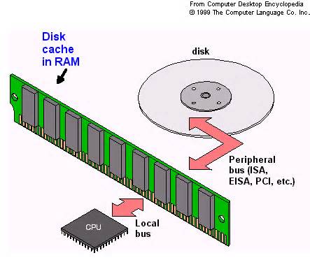
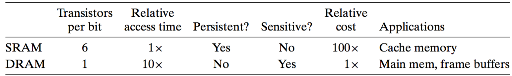
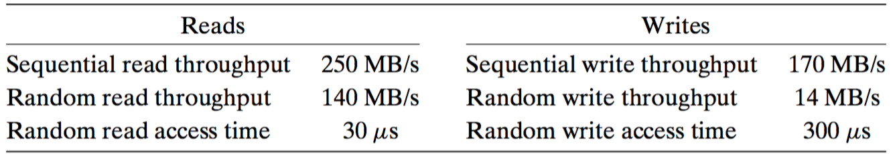

# 6 存储器层次结构
---

**基本而持久的思想：**如果理解了系统是如何将数据在存储器层次结构中上上下下移动的，那么你就可以编写你的应用程序，是的他们的数据项存储在层次结构较高的位置，从而CPU更快的访问他们

## 6.1 存储技术

SRAM：做高速缓存，利用双稳态存储单元，有电就永保其值，即使有干扰

DRAM：做主存或图形系统的帧缓存，利用电容，对干扰敏感，需要刷新

闪存：非易失性村粗器  

SSD

磁盘： 访问时间=寻道时间+旋转时间+传送时间

磁盘驱动器为何着逻辑块号和实际物理磁盘扇区之间的映射

**一个典型SSD的性能特征**：顺序读写性能行相当，顺序读比顺序写稍微快；随机写比随机读慢一个数量级

## 6.2 局部性

局部性原理是一个持久性的概念

程序员应该理解局部性原理，有良好局部性的程序比局部性差的程序运行的更快

寄存器 -> 高速缓存 -> 主存 -> 本地磁盘 -> CDN -> 代理服务器 -> server ->  DB

步长为1的引用模式是空间局部性常见和重要的来源

## 6.3 存储层次结构

数据总是以块为传输单元在不同层次之间来回拷贝，更远的层次使用较大的块，弥补较长的访问时间

利用时间局部性：同一个对象可能被多次访问，所以一次发生不命中后，会加载到缓存，期待以后访问迅速

利用空间局部性：该对象附近的对象后面也有可能被访问，所以更新缓存的时候是用block作为单元

## 6.4 高速缓存

高速缓存的基本单元是缓存行 cache line ， 每个cache line有有效位，标记位，数据块组成。

高速缓存的容量大小不包括有效位和标记位在内。

如何知道缓存是否命中，标记和地址对应的标记一样并且缓存行有效

映射方式，计算命中率，考研的时候这些东西很熟悉

直写 write through , 写回 write back

## 6.5 cache友好代码

* 对局部变量的反复引用是好的
* 步长为1的引用模式是好的

## 6.6 高速缓存对程序性能的影响

存储器山：不同工作集 和 存取步长 对 读性能的 影响

[mountain.c](mountain.c)

* 将注意力集中在内循环上，大部分的计算和存储访问都发生在这里
* 按行优先，步长1
* 一旦从存储器读入了一个数据对象，就尽可能多的使用它

