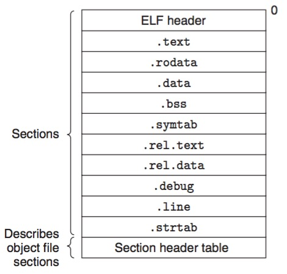

# 链接
---


> ## 链接器使得separate compilation成为可能，不必将应用组织为一个巨大的源文件，而是分解为可管理的小模块，独立的修改编译发布


## 初识compiler driver

[main.c](main.c),  [swap.c](swap.c)

```bash
$ gcc -O2 -g -o p main.c swap.c
```

运行过程是：  C预编译器 cpp -> C编译器 ccl -> 汇编器 as -> 链接器 ld


## 可重定位目标文件

ELF可重定位目标文件格式



|    字段  |	    描述   	|
| --- | --- |
| ELF头 | 目标文件类型，字大小，字节顺序，其他section的元数据 |    
|.text| 已编译程序的机器码|
|.rodata||


**查看ELF文件：**

使用objdump命令，在Linux下直接搞，在MAC下要安装 binutils(命令brew install binutils)，然后所有的命令加前缀g，比如这里使用gobjdump 


P455 - foo3.c   bar3.c 
P458  - addvec.c multvec.c  main2.c 


Blogs:

1.探寻ELF文件内部：
http://blog.csdn.net/vonzhoufz/article/details/44925439

2.创建并使用静态库（ar 命令）
http://blog.csdn.net/vonzhoufz/article/details/44463977

